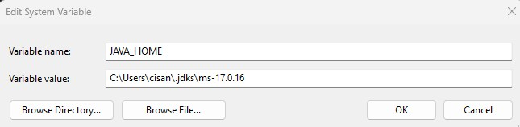
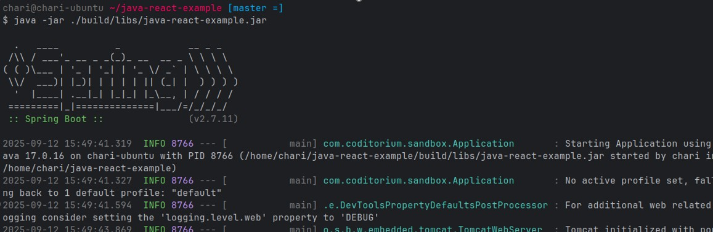
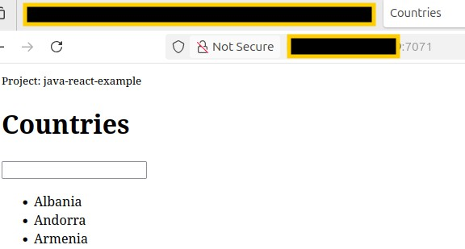

## 📌 Cloud Basics Demo Project"
**Create server and deploy application on DigitalOcean Droplet**

## 🛠 Tech Stack:
**DigitalOcean Droplet, Linux, Java, Gradle, ChatGPT**

#### Project Description:
- Setup and configure a server on DigitalOcean
- Create and configure a new Linux user on the Droplet
- Firewall Configuration Security Best Practice
- Deploy and run a Java Gradle application on Droplet

## 🚀 Downloads
1. Clone this repository:
   ```bash
   git clone git@github.com:CharismaIsland/Basic-Cloud-Server-Deploy-Java-React-Maven-App.git
   cd cloud-basics-create-server
   ```
2. Install Requirements:   
   - Java JRE SDK ver. 17 only
   - Gradle ver. 8.14.3
   - IntelliJ IDE (will be used to build gradle project)
   
## 🚀 How to Recreate This DevOps Project   
**For Windows**
1. Find the Java installation path:
    - Default: C:\Program Files\Java\jdk-<version>
    - Copy this path.
2. Set Java_Path:
    - Go to Advanced System Settings:
    - Click Environment Variables
    - Click New:
    - Set New Variable name: JAVA_HOME
    - Variable value: path to JDK folder 
    (e.g., C:\Program Files\Java\jdk-<version>)


3. Verify
    - Open Commmand Prompt and run:
 ```bash
    java -version
    javac -version
    echo %JAVA_HOME%
```

---
**For Linux/MacOS**
1. Find Java Installation Path
 ```bash
    which java
    readlink -f $(which java)
```
2. Set JAVA_HOME
    - Open profile file: 
        - ~/.bashrc or ~/.zshrc
    - Add:
 ```bash
export JAVA_HOME=/usr/lib/jvm/java-17-openjdk-amd64
export PATH=$JAVA_HOME/bin:$PATH
```


## 🔧 Troubleshooting
If you encounter compatibility issues, copy error message into ChatGPT for step-by-step assisstance. Context Prompt:
```bash
I am trying to set the Java JAVA_HOME environment variable, but I’m running into an error.
Here is the exact message I see from my console/terminal:

"Copy and paste the exact message here"

help me figure out what’s causing this and how to fix it?
```

---
## 🧑‍💻 Manual Setup
**Setup Digital Ocean Server or Cloud Provider of Choice**
1. Free Tier - Select Basic CPU - at least 1GB in region nearest to you
2. Allow TCP Port 22 to Your IP only
3. Create SSHKey to connect to server from your local PC
    - Follow Instructions with Cloud Provider if you need to create your first SSHKey
4. Open TCP Port 7071 (will be used to connect to App later http://localhost:7071)

**Configure and Build Gradle**
1. Create a Gradle folder under C:\drive
2. Copy download to new Gradle folder and unzip
3. Use IntelliJ IDE - Open Folder where repo downloaded 'java-react-example'
4. In IDE Terminal - Build Gradle Project - Run Command:
```bash
gradle build
```
5. Test App
```bash
java -jar ./build/libs/java-react-example.jar 
```


6. Secure Copy .jar file from your local host to server public IP
```bash
scp build/libs/java-react-example.jar root@<replace_with_server_ip>:/root
```
7. Connect to Cloud server via SSH via Terminal or Putty (for Windows)
```bash
ssh root@<server-public-ip>
```
8. Run Java App On Server with Command:
```bash
java -jar java-react-example.jar 
```
9. Connect App from Browser on http://localhost:7071



10. Remember to terminate cloud server to avoid unnecesary costs


## 🔑 Notes
- All data is mock/simulated for educational purposes.
- Remember to Terminate Hosts 
- Optimize and Add as you see fit
- Consider creating Terraform template for Infrastructure as Code


## 🎯 Enjoy Building 🚀